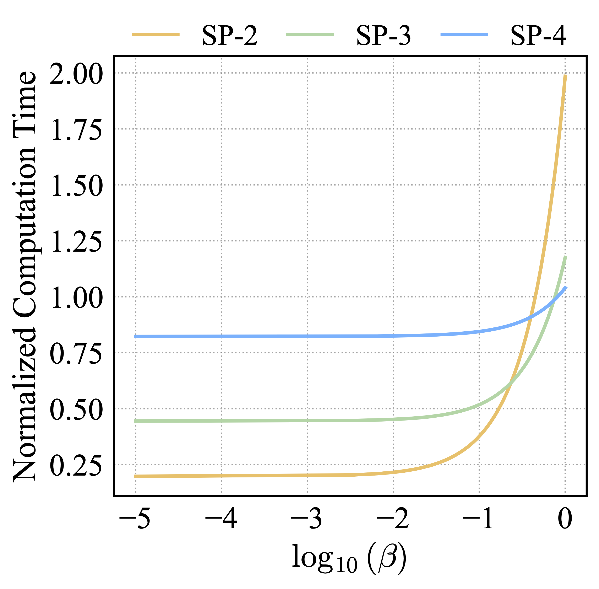
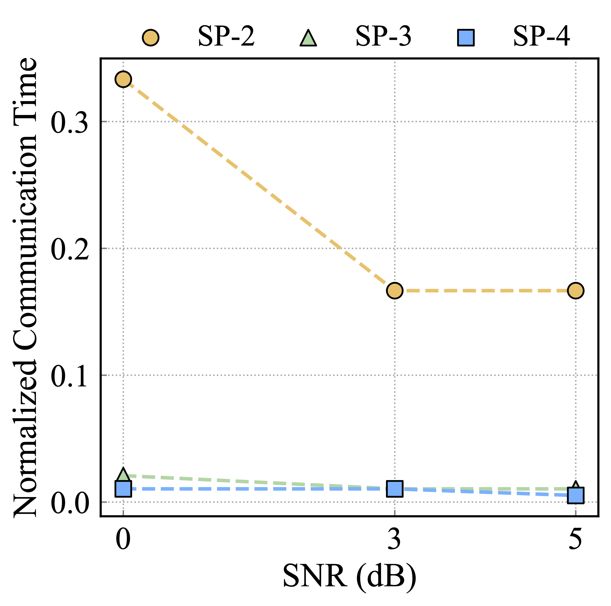

# Deep-Semantic-Inference-over-the-Air

This repository is the implementation of the paper "Deep Semantic Inference over the Air: An Efficient Task-Oriented Communication System"
[[Paper(arXiv)]](https://arxiv.org/abs/2508.12748)

<div align="center">
    
</div>

## Datasets
[_CIFAR-10 and CIFAR-100_] (https://www.cs.toronto.edu/~kriz/cifar.html)

## Environment

This project was developed with:

- Python 3.12.9
- PyTorch 2.7.0
- torchvision 0.22.0
- CUDA 12.8
- OS: Ubuntu 20.04.6 LTS

## Training & Testing
```
 python comm_cifar100_resnet34_SP-2.py
```

## Results

The results shown in Fig. 3 and Fig. 4 are obtained through the following pipeline:

1. `plot_all.py`
2. `plot_all_column.py` / `plot_all_row.py`
3. `merged_column.py` / `merged_row.py`

## Visualization

Fig. 5 and Fig. 6 are generated using the following scripts, respectively:

- `plot_beta_t.py`
- `plot_snrdb_t.py`

<table align="center" width="100%">
  <tr>
    <td align="center" width="50%">
      
    </td>
    <td align="center" width="50%">
      
    </td>
  </tr>
</table>
